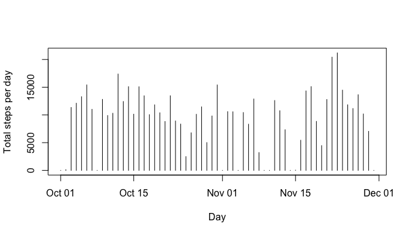
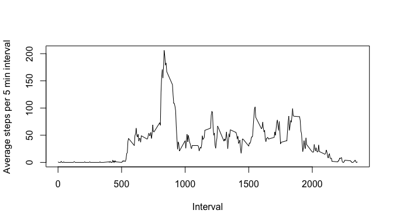
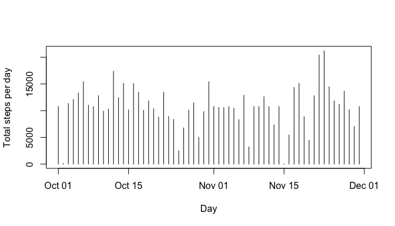
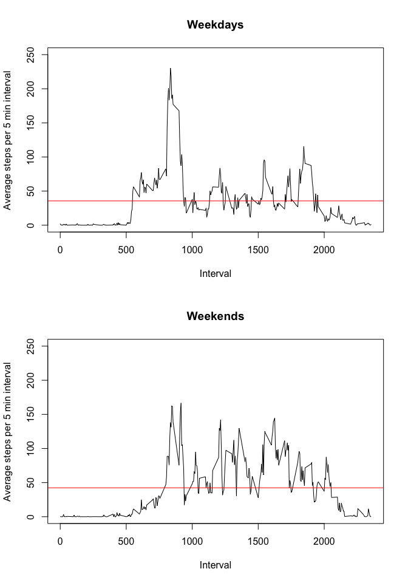

# Reproducible Research: Peer Assessment 1

Author: Daniel Kinpara  
Date: April, 2015  


### 1. Loading and preprocessing the data

The first step was to read the file **activity.zip** and to save it in the object *dados*. The ZIP file must be placed in the same folder of this Markdown document in order to run the embedded code. The variable **date** was converted to a *date* class.


```r
if (!file.exists("activity.csv")) {
        unzip("activity.zip")
}
dados <- read.csv("activity.csv", header = TRUE, na.strings = "NA")
dados[,2] <- as.Date(dados[,2], "%Y-%m-%d")
str(dados)
```

```
## 'data.frame':	17568 obs. of  3 variables:
##  $ steps   : int  NA NA NA NA NA NA NA NA NA NA ...
##  $ date    : Date, format: "2012-10-01" "2012-10-01" ...
##  $ interval: int  0 5 10 15 20 25 30 35 40 45 ...
```
  
### 2. What is mean total number of steps taken per day?  

The code below created a factor variable named **dia** that was used to split the dataset. The *tapply* summed the number of steps per day. The average was calculated and stored in the variable **mediaPassoDia**. The median was stored in the variable **medianaPassoDia**.


```r
dados <- transform(dados, dia = as.factor(dados$date))
totalPassoDia <- tapply(dados$steps, dados$dia, sum, na.rm = TRUE)
mediaPassoDia <- mean(totalPassoDia)
medianaPassoDia <- median(totalPassoDia)
y <- as.integer(totalPassoDia)
x <- as.Date(names(totalPassoDia))
plot(x, y, type="h", xlab="Day", ylab="Total steps per day")
```

 

So, the average number of steps per day was **9354**. The median was **10395**. The missing data was excluded from the calculation.  

### 3. What is the average daily activity pattern?  

The code created a factor variable named **tempo** that was used to split the dataset. The *tapply* averaged the number of steps per interval for all measured days. The average was stored in the variable **mediaPassoTempo**.  


```r
dados <- transform(dados, tempo = as.factor(dados$interval))
mediaPassoTempo <- tapply(dados$steps, dados$tempo, mean, na.rm = TRUE)
y <- as.integer(mediaPassoTempo)
x <- names(mediaPassoTempo)
plot(x, y, type = "l", xlab = "Interval", ylab = "Average steps per 5 min interval")
```

 

The highest average steps occurred in the **835** interval. The missing data was excluded from the average calculation.

## Imputing missing values  

- The total number of missing values was **2304**.  

The missing value of a giving interval was substituted by the average of the same interval across the measured days. The following code created a new dataset called **dadosSemNA**. It checks wether the row has a NA in the **steps** variable. If it does, the respective interval average is searched in the variable **mediaPassoTempo**.  


```r
numMedidas <- length(dados$steps)
dadosSemNA <- dados
for(i in 1:numMedidas){
        if(is.na(dadosSemNA[i, 1])){
                dadosSemNA[i,1] <- mediaPassoTempo[as.character(dadosSemNA[i, 5])]
        }
}
totalPassoDia <- tapply(dadosSemNA$steps, dadosSemNA$dia, sum)
mediaPassoDia <- mean(totalPassoDia)
medianaPassoDia <- median(totalPassoDia)
y <- as.integer(totalPassoDia)
x <- as.Date(names(totalPassoDia))
plot(x, y, type="h", xlab="Day", ylab="Total steps per day")
```

 

After missing data replacement, the average number of steps per day was **10766**. The median was **10766**. Both values were higher than the ones obtained with the dataset with missing values.  

## Are there differences in activity patterns between weekdays and weekends?

The code below created a new column called **semana** which identifies the weekdays (level 1) and weekends (level 2). Through the function *aggregate* was calculated the mean for each group, *weekday* and *weekend*.  


```r
dadosSemNA <- transform(dadosSemNA, semana = factor(rep(1, numMedidas), levels = c(1, 2), labels = c("weekday", "weekend")))
for(i in 1:numMedidas){
        if(weekdays(dadosSemNA[i, 2]) == "Sunday" | weekdays(dadosSemNA[i, 2]) == "Saturday"){
                dadosSemNA[i, 6] <- "weekend"
        }
        else{
                dadosSemNA[i, 6] <- "weekday"
        }
}
dadosSplit <- with(dadosSemNA, aggregate(x = steps, by = list(semana, tempo), FUN = "mean"))
par(mfrow = c(2,1))
x <- levels(dadosSplit$Group.2)
y1 <- dadosSplit[dadosSplit$Group.1 == "weekday", 3] 
y2 <- dadosSplit[dadosSplit$Group.1 == "weekend", 3]
mediaY1 <- mean(y1)
mediaY2 <- mean(y2)
plot(x, y1, type = "l", main = "Weekdays", xlab = "Interval", ylab = "Average steps per 5 min interval", ylim = c(0, 250))
abline(mediaY1, 0, col = "red")
plot(x, y2, type = "l", main = "Weekends", xlab = "Interval", ylab = "Average steps per 5 min interval", ylim = c(0, 250))
abline(mediaY2, 0, col = "red")
```

 

The results showed that the activity patterns were different. During the weekdays, the individual took more steps in a short period of time, concentrated in the begining of the day and in the end of the day. However, in the weekends, one took less steps per period of time, but constantly along the day. So, the averages along the day were not so different. During the weekdays, the subject took an average of **36** steps per 5 min interval along the day. During the weekends, the average was **42** steps. The total steps per day taken during the weekdays was **10256** steps and, during the weekends, it was **12202** steps. So, the subject walked per day more during the weekends.  
